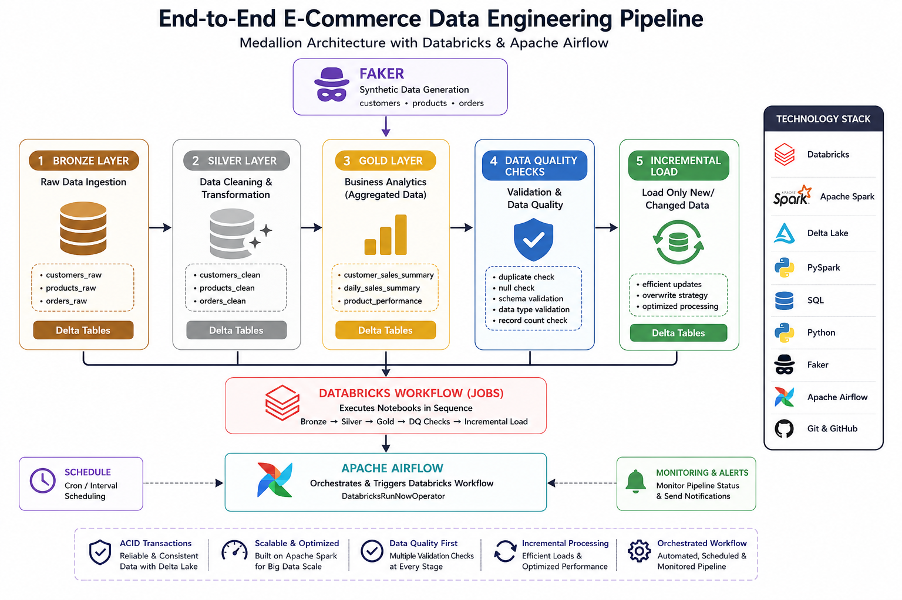

# 🚀 End-to-End E-Commerce Data Engineering Pipeline

An end-to-end Data Engineering project that demonstrates how to build a modern data pipeline using **Databricks**, **Apache Spark**, **Delta Lake**, and **Apache Airflow** following the **Medallion Architecture (Bronze → Silver → Gold)**.

The pipeline ingests synthetic e-commerce data, transforms it into analytics-ready datasets, and automates execution using Airflow.

---

# 📌 Project Overview

This project simulates a real-world e-commerce data platform where customer, product, and order data are generated using Faker, processed with PySpark, stored as Delta tables, and orchestrated with Apache Airflow.

The implementation demonstrates modern data engineering concepts including ETL pipelines, Delta Lake, data quality checks, incremental processing, and workflow orchestration.

---

# 🏗️ Architecture



---

# ⚙️ Technology Stack

| Technology     | Purpose                     |
| -------------- | --------------------------- |
| Databricks     | Data Engineering Platform   |
| Apache Spark   | Distributed Data Processing |
| PySpark        | ETL Development             |
| Delta Lake     | ACID Storage Layer          |
| SQL            | Analytics & Transformations |
| Python         | Data Processing             |
| Faker          | Synthetic Data Generation   |
| Apache Airflow | Workflow Orchestration      |
| Git & GitHub   | Version Control             |

---

# 📂 Repository Structure

```
DATA-ENGINEERING-PROJECT
│
├── architecture/
├── dags/
├── images/
├── notebooks/
│   ├── 01_Bronze_Ingestion.ipynb
│   ├── 02_Silver_Transformation.ipynb
│   ├── 03_Gold_Aggregation.ipynb
│   ├── 04_Data_Quality_Checks.ipynb
│   └── 05_Incremental_Load.ipynb
│
├── sql/
└── README.md
```

---

# 🥉 Bronze Layer

Stores raw data exactly as received from the source.

Tables:

* `customers_raw`
* `products_raw`
* `orders_raw`

Implemented:

* Raw data ingestion
* Delta table creation
* Schema management

---

# 🥈 Silver Layer

Performs data cleansing and transformations.

Tables:

* `customers_clean`
* `products_clean`
* `orders_clean`

Implemented:

* Data cleaning
* Null handling
* Data validation
* Standardization
* Type casting
* Duplicate removal

---

# 🥇 Gold Layer

Creates business-ready datasets for analytics.

### Customer Sales Summary

* Total Orders
* Total Sales
* Average Order Value

### Daily Sales Summary

* Daily Revenue
* Daily Orders
* Sales Trends

### Product Performance

* Revenue by Product
* Quantity Sold
* Product Rankings

---

# 🔄 Workflow Orchestration

The entire pipeline is orchestrated using **Apache Airflow**.

Workflow:

1. Trigger Databricks Job
2. Execute Bronze Notebook
3. Execute Silver Notebook
4. Execute Gold Notebook
5. Perform Data Quality Checks
6. Complete Pipeline Successfully

---

# ✅ Features

* Medallion Architecture
* Delta Lake Tables
* End-to-End ETL Pipeline
* PySpark Transformations
* Apache Airflow Orchestration
* Data Quality Validation
* Incremental Processing
* Git Version Control
* Production-style Project Structure

---

# 📊 Sample Datasets

* Customers: **10,000+**
* Products: **5,000+**
* Orders: **100,000+**

---

# 🚀 Future Enhancements

* AWS S3 Integration
* dbt Transformations
* Power BI Dashboard
* CI/CD Pipeline using GitHub Actions
* Data Observability
* Unit & Integration Testing

---

# 📸 Project Screenshots

Add screenshots in the `images/` folder.

Suggested screenshots:

* Airflow DAG
* Successful Airflow Run
* Databricks Workflow
* Bronze Tables
* Silver Tables
* Gold Tables
* Query Results

---

# 👨‍💻 Author

**Anshu Gupta**

Aspiring Data Engineer

### Skills

* Python
* SQL
* Apache Spark
* PySpark
* Databricks
* Delta Lake
* Apache Airflow
* Git & GitHub
